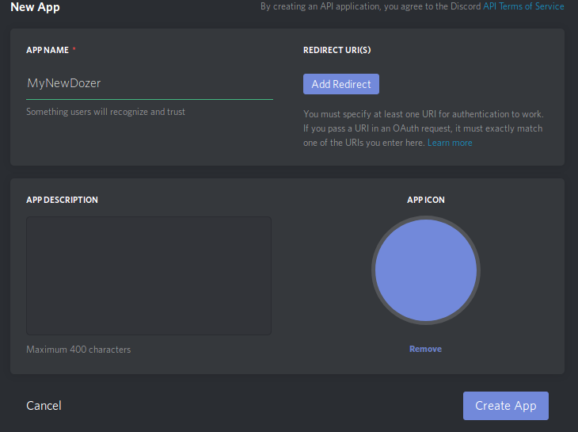

# Dozer
Omnipotent guild management bot for FIRST Discord servers

## Setup

### Installing Python 3.6

run `python -V` to find what version of python you are running. If you are running version 3.6 or newer, feel free to skip this section

 #### manually

[Unix](https://docs.python.org/3/using/unix.html?highlight=install)

[Windows](https://docs.python.org/3/using/windows.html)

run `python -V` to ensure that version 3.6 or newer is installed. 

#### using pyenv

Many distributions do not have python 3.6 in their repositories yet. If this is the case for you, then [pyenv](https://github.com/pyenv/pyenv) is a great option for managing different python versions.

Instructions for installing are located [here](https://github.com/pyenv/pyenv-installer).

1. `pyenv install 3.6.3` downloads and builds a newer version of python
2. `pyenv global 3.6.3` sets 3.6.3 as the primary version for the current user
3. run `python -V` to ensure that version 3.6 or newer is installed. 

### Getting your Discord Bot Token

1. Go to the [Discord Developer Portal](https://discordapp.com/developers/applications/me) and create a new application.

    

2. Create a bot user inside of your application. 

   
3. Copy the bot user token - We'll need that later!
   Do not share your token with anyone.

### Getting a Google Maps API Key

1. Go to the [Google Map APIs Docs](https://developers.google.com/maps/documentation/javascript/get-api-key) and request an API key
2. Create a new project. 

   
3. Copy the API key - We'll need this too!

### Setting up the bot

1. Install dependencies with `python3 -m pip install -Ur requirements.txt`
2. Run the bot once with `python3 -m dozer`. This will crash, but generate a default config file.
3. Add the Discord bot account's token to `discord_token` in `config.json`
4. Add your Google Maps API key to `gmaps_key` in `config.json`
5. Add information about your team and your bot to `tba` in `config.json`
6. Add your ID, and anyone else's ID who should be able to use the developer commands, to the list `developers` in `config.json`
7. Run the bot again, you should see `Signed in as username#discrim (id)` after a few seconds.

### adding the bot to your server

1. To add the bot to your server, paste the following link into your browser.  Your client ID can be found on the applications page in the [Discord Developer Portal](https://discordapp.com/developers/applications/me)

   `https://discordapp.com/oauth2/authorize?client_id=YOUR_CLIENT_ID&scope=bot`

2. Select the server that you would like to add the bot to.

3. Try it out! `[prefix]help` to see what Dozer can do.

   ​